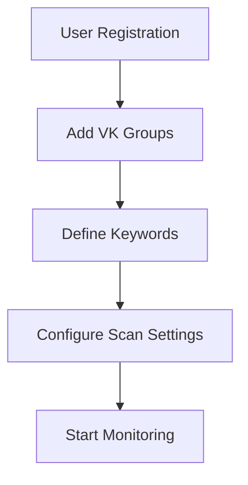
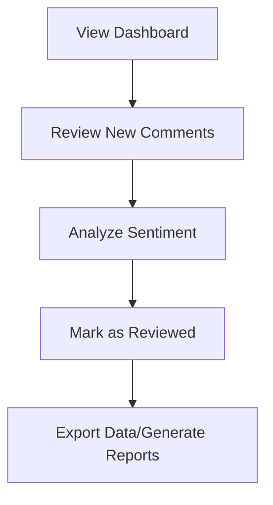
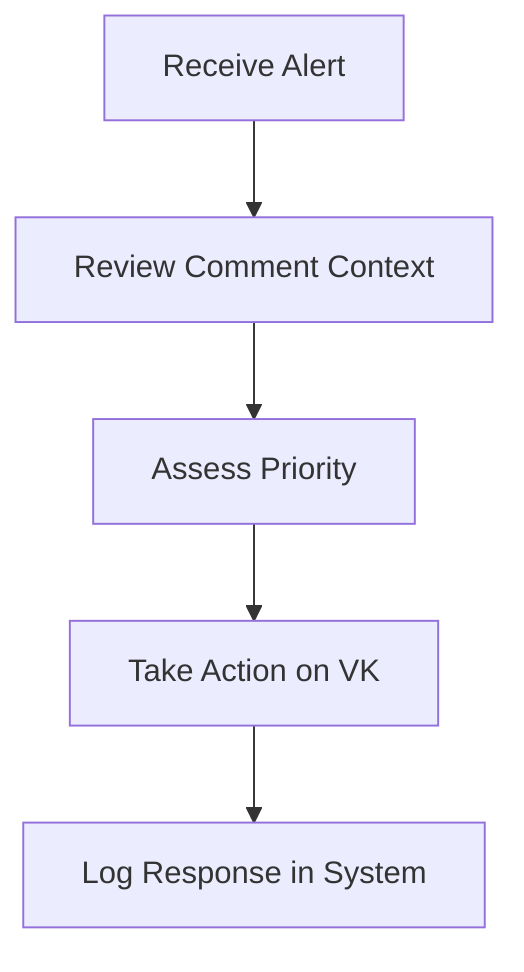

# MEMORY BANK: PRODUCT CONTEXT

## 🎯 PRODUCT UNDERSTANDING

### Business Purpose
**Core Mission:** Automated monitoring and analysis of VK group comments to identify mentions of specific keywords, enabling businesses and organizations to track brand mentions, customer feedback, and market sentiment.

### Target Users
- **Social Media Managers:** Monitor brand mentions and customer feedback
- **Marketing Teams:** Track campaign performance and customer sentiment
- **Business Analysts:** Gather market intelligence from social discussions
- **Community Managers:** Identify and respond to customer concerns
- **Researchers:** Analyze social media trends and patterns

### Core Value Proposition
- **Automated Monitoring:** 24/7 scanning of VK groups without manual effort
- **Real-time Alerts:** Immediate notification of keyword matches
- **Comprehensive Tracking:** Historical data for trend analysis
- **Scalable Solution:** Monitor multiple groups and keywords simultaneously
- **Data-Driven Insights:** Structured data for business intelligence

## 📊 FEATURE SCOPE ANALYSIS

### Core Features (MVP)
- [x] **Group Management:** Add/remove VK groups for monitoring
- [x] **Keyword Management:** Define and manage search keywords
- [x] **Comment Scanning:** Automated background scanning of group comments
- [x] **Comment Storage:** Persistent storage of matched comments
- [x] **Web Interface:** User-friendly dashboard for monitoring
- [x] **REST API:** Programmatic access to data and functionality

### Extended Features (Phase 2)
- [x] **Advanced Search:** Case sensitivity, whole word matching options
- [x] **Sentiment Analysis:** Automatic sentiment classification of comments
- [x] **User Tracking:** Author profile information and history
- [x] **Notification System:** Email/webhook alerts for new matches
- [x] **Data Export:** CSV/JSON export functionality
- [x] **Reporting Dashboard:** Analytics and trend visualization

### Advanced Features (Future)
- [ ] **Machine Learning:** Automated keyword suggestion and relevance scoring
- [ ] **Multi-Platform:** Extend to other social media platforms
- [ ] **Team Management:** Multi-user access with role-based permissions
- [ ] **API Rate Optimization:** Intelligent scanning frequency optimization
- [ ] **Integration APIs:** Webhooks and third-party service integration

## 🔄 BUSINESS WORKFLOW ANALYSIS

### Primary User Workflows

#### 1. Setup and Configuration

#### 2. Monitoring and Analysis

#### 3. Response and Action

### Business Process Requirements
- **Real-time Processing:** Comments should be processed within 5 minutes of posting
- **Data Retention:** Configurable retention periods (default 1 year)
- **Access Control:** Role-based permissions for team environments
- **Audit Trail:** Complete log of user actions and system changes
- **Data Privacy:** GDPR-compliant data handling and user consent

## 🎯 SUCCESS CRITERIA & KPIs

### User Experience Metrics
- **Setup Time:** < 10 minutes from registration to first scan
- **Response Time:** < 2 seconds for dashboard loading
- **Comment Processing:** < 5 minutes from VK post to system detection
- **Accuracy Rate:** > 95% keyword match precision
- **Uptime:** > 99.5% system availability

### Business Value Metrics
- **Cost Efficiency:** 80% reduction in manual monitoring time
- **Coverage Improvement:** 10x increase in monitored content volume
- **Response Speed:** 5x faster response to customer mentions
- **Data Insights:** 90% improvement in trend identification accuracy
- **ROI Measurement:** Clear attribution of business outcomes to social monitoring

### Technical Performance Metrics
- **Scalability:** Support 1000+ groups and 10,000+ keywords
- **Throughput:** Process 100,000+ comments per day
- **Reliability:** < 0.1% false positive rate for keyword matching
- **Efficiency:** Optimal VK API usage within rate limits
- **Security:** Zero data breaches or unauthorized access

## 📝 STAKEHOLDER REQUIREMENTS

### Primary Stakeholders
- **End Users:** Intuitive interface, reliable monitoring, actionable insights
- **System Administrators:** Easy deployment, monitoring tools, security controls
- **VK Platform:** API rate limit compliance, terms of service adherence
- **Data Subjects:** Privacy protection, data control, consent management

### Compliance Requirements
- **VK API Terms:** Compliance with VK API usage policies
- **Data Protection:** GDPR compliance for EU users
- **Privacy Laws:** Local data protection regulation compliance
- **Security Standards:** Industry-standard security practices
- **Accessibility:** WCAG compliance for user interface

## 🎯 COMPETITIVE ANALYSIS

### Key Differentiators
- **VK Specialization:** Deep integration with VK platform specifics
- **Real-time Processing:** Faster detection than general social monitoring tools
- **Cost Effectiveness:** Lower cost than enterprise social monitoring solutions
- **Ease of Use:** Simplified setup compared to complex enterprise tools
- **Open Source Option:** Transparent, customizable solution

### Market Positioning
- **Target Segment:** SMBs and mid-market companies focused on Russian market
- **Price Point:** Competitive pricing vs. enterprise solutions
- **Value Proposition:** Specialized VK monitoring with enterprise-grade reliability
- **Growth Strategy:** Start with VK, expand to other CIS social platforms

## 🔄 DEVELOPMENT APPROACH ALIGNMENT

### Agile Methodology Integration
- **User Stories:** Feature development driven by user value
- **Iterative Delivery:** MVP first, then incremental enhancements
- **User Feedback:** Continuous feedback loop for product improvement
- **Data-Driven Decisions:** Analytics-informed feature prioritization

### Quality Assurance Strategy
- **User Acceptance Testing:** Real user scenario validation
- **Performance Testing:** Load testing with realistic data volumes
- **Security Testing:** Comprehensive security vulnerability assessment
- **Usability Testing:** User experience validation across personas

## 📋 PRODUCT ROADMAP INTEGRATION

### Phase 1: Foundation (Months 1-2)
- Core monitoring functionality
- Basic web interface
- Essential API endpoints
- User authentication and authorization

### Phase 2: Enhancement (Months 3-4)
- Advanced search capabilities
- Sentiment analysis integration
- Notification systems
- Enhanced reporting features

### Phase 3: Scale (Months 5-6)
- Performance optimization
- Multi-user team features
- Advanced analytics dashboard
- Integration API development

### Phase 4: Growth (Months 7+)
- Machine learning capabilities
- Platform expansion
- Enterprise features
- Third-party integrations 